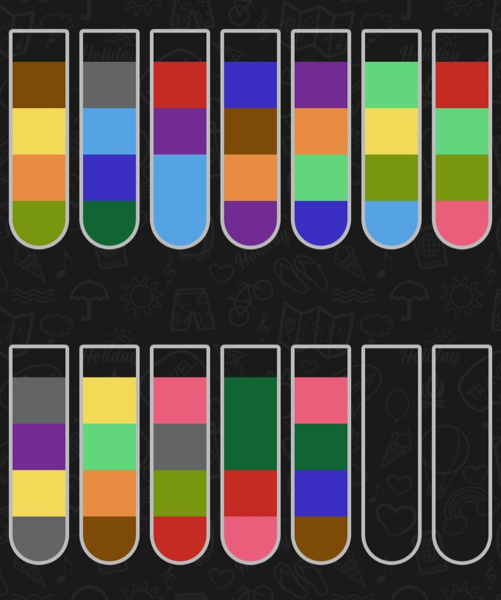

# colour-bottles-solver

This program is designed to solve tasks from the Water Sort - Color Puzzle Game.
The game's objective is to strategically sort colored water until all colors within each vial match.



## Usage
To run the solver, follow these steps:

1. Build the program:
    ```bash
    make build
    ```

2. Run the solver by specifying the input file (e.g., `example.json`):
    ```bash
    ./bin/solver -file=example.json
    ```
